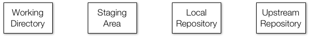

```{r setup, include=FALSE}
knitr::opts_chunk$set(echo = TRUE)
```

## So you want to submit a package to Bioconductor?

Suppose you've already done the following:

- Made an R package
- Documented all of the exported objects in the package
- Wrote an introductory vignette
- Checked the package with `R CMD check` and `BiocCheck`

What now?

- Submit the package by opening a new issue in `Contributions` repo
- Respond to reviewers and make any necessary changes to the package 
- After acceptance, continue to manage and update your package

## Bioconductor release cycles

- Bioconductor always maintains a *release version* that is updated twice a year (usually in April and October), for users

- Bioconductor also has a *development version* where new packages are introduced and existing packages are updated in preparation for the next release cycle

- Developers are expected to use the "devel" branch of Bioconductor, to make sure their packages are compatible with the next version of Bioconductor

## Using the "Devel" version of Bioconductor

Typically, to use the developer version of Bioconductor, you only need to do the following:

```{r eval=FALSE}
if (!requireNamespace("BiocManager", quietly=TRUE))
    install.packages("BiocManager")
BiocManager::install(version = "devel")
BiocManager::valid()  # checks for out of date packages
```

However, during the October to April release cycle, the *devel* version of Bioconductor also requires the *devel* version of R.

The April to October release cycle uses the release version of R.

## Before submitting

Make sure you have done the following:

- Created a package (this part should be obvious)

- Used existing Bioconductor classes where appropriate

- Documented the package

- Included an introductory vignette

- Included unit tests

- Passed `R CMD check` and `BiocCheck` *with the "devel" version of Bioconductor and appropriate version of R*

## How are packages submitted and hosted by Bioconductor?

Bioconductor is maintained using the **Git** source control system.

Developers manage their packages by pushing updates directly to their packages' **Git** repositories on Bioconductor.

To submit a *new* package:

- Create a **Github** repository for your package

- Open a new *issue* on the `Bioconductor/Contributions` **Github** repository and follow the guidelines in the "README"

But what are Git and Github and why does Bioconductor use them?

## Is this you?


## Version control / source control

A version control system manages versions of documents and tracks changes between them.

- Automatically tracks changes made to documents and projects

- Keeps a history log of all major and minor changes

- Allows reverting to earlier versions

- Compare different versions of documents

- Share and sync projects between people

A good version control system is essential to managing source code for large projects like Bioconductor (and your packages!).

## Git and Github

**Git** (often simply "git") is one of the most common version control systems. It is a program that allows you to create repositories (or repos) wherein every document in it is tracked. Git repos can exist on your personal computer, on a server on the internet, or (usually) both.

**Github** is an online service that hosts git repositories for free (if they're public) or a small fee (if they're private). You can use GitHub to host and share your coding projects with the world.

To submit a package to Bioconductor and maintain it after it is accepted, we must learn to use git and Github!

## Initializing a git repository

Although there exist GUIs for git, and many IDEs including RStudio feature Git/GitHub integration, we will focus on understanding the fundamentals of the command line version.

It's easy to initialize a git repository on your computer.

Assuming you have git installed, just navigate to the directory that you want to track in your Terminal, and type:

```
git init
```

All of the files and subdirectories in that directory are now tracked by git.

However, it's still your responsibility to tell git when you make changes that you want git to record.

## Understanding git

To understand git, it's helpful to understand the four areas that git operates:

\center

{width=65%}\


- The **working directory** is the actual directory on your computer where you're working

- The **staging area** is a set of files in your working directory that you've changed since your last *commit*

- Your **local repository** is the version of the git repo on your computer. It includes the files you can see in it, but also includes all the files and changes that have ever been part of your project history. These are hidden in an invisible `.git` directory that git uses.

- The **remote repository** is a version of the repository hosted on a remote site such as GitHub. This is where you share your code publicly. If you are working on a team, this is where the canonical version of your project lives while you work on your local versions.

## Git workflow

Four basic commands will give you the bare minimum you need to navigate your git workflow:

- `git add` will add new or changed files to the *staging area*

    + `git add --all` will add all new or changed files to the staging area

- `git commit` will create a snapshot of the current state of your repo, along with a SHA-1 identifier, and a commit message

    + `git commit -m "my commit message"` is a shortcut for including your commit message with the command
  
- `git push <name of remote> <name of branch>` will push your most recent commits from your local repo to a remote repo

    + Typically `git push origin master`

- `git pull <name of remote> <name of branch>` will pull the most recent commits from a remote repo to your local repo

    + Typically `git pull origin master`

## Git workflow visualized


## A typical git workflow

A simple git/GitHub workflow when collaborating on a project with a team looks something like this:

1. Make changes to your local repo (edit code, add files, etc.)

2. Stage those changes for commit with `git add`

3. Commit those changes to your local repo with `git commit`

4. Grab any changes by your teammates from GitHub with `git pull`

5. Push your own changes to GitHub with `git push`

6. Repeat steps 1-5

While git will automatically merge as many changes as it can, when it finds conflicting changes, you will have to resolve these yourself, and then commit those changes.

## Use branches to manage projects

Once you have the basics down, "branches" become a useful way to manage different aspects of a complex project.


## Understanding branches

Sometimes there are different diverging "branches" your project may take. For example, you want to make big changes to implement a new feature without impacting your stable code base.

You can create a new branch dedicated to developing the new feature, and then merge it back into your master branch after it is complete.

You can create a new branch called `new-feature` and switch to it using:

```
git checkout -b new-feature
```

You can make changes and commit them to this new branch without impacting your master branch.

## Understanding branches (cont'd)

While you're working on your new feature in your `new-feature` branch, you can continue to make changes and updates to your `master` branch as well. You can switch back to your master branch with:

```
git checkout master
```

When you're done with the new feature, you can merge all of the changes from one branch into another branch. To merge your feature from your `new-feature` into your `master` branch, you can do:

```
git checkout master
git merge new-feature
```

If there are any conflicts that can't be merged automatically, you will be asked to make manually fix them and commit the changes.

## More on branches

You can have as many branches as you want. It is generally useful to creature new branches when making large changes, so you can isolate them from your stable code, and from each other if you are working on multiple features at once.


## Putting your package on Github

Github is one of the most common online hosts for git repositories, and Bioconductor uses it for new package submissions.

There are several ways to get your package on Github. My preferred method is to use the command line:

- Create a new repository on Github

- Initialize your package as a local git repo if it isn't already

    - `git init`
    
    - `git add --all`
    
    - `git commit -m "Initial commit"`

- Add the Github as a remote repo and push your local repo

    - `git remote add origin https://github.com/User/Repo.git`
    
    - `git push -u origin master`

Your package is now on Github and ready to submit!

## Submit your package to Bioconductor

Submitting to Bioconductor is simple now.

Follow the instructions of the `README.md` file at https://github.com/Bioconductor/Contributions:

- Create a public SSH key and add it to your Github account

    - This will give you access to the Bioconductor git repository for your package after package acceptance
    
    - We won't discuss SSH keys further; simply follow the linked instructions on the README

- Open a new issue in the `Bioconductor/Contributions` repository: https://github.com/Bioconductor/Contributions/issues/new

- Add a webhook to your repository

    - This will allow any commit to your "master" branch to trigger a new Bioconductor build of your submitted package
    
    - Again, we won't discuss this further; simply follow the linked instructions on the README
    
- Respond to reviewers and make any necessary changes

## My package is accepted -- now what?

Congratulations! After your package is accepted, you will need to continue to maintain and update it.

To maintain your package, you will need to:

- Check your package's build reports and fix any errors or warnings

- Push any changes to your package's Bioconductor git repository

On Bioconductor, your package's git repo will include several branches: one for each release version, and a `master` branch for the current devel.

Although you will typically be making changes to the `master` branch (i.e., the "devel" branch of Bioconductor) you may sometimes need to make bug fixes to the release version if they are very important.

## Pushing changes to Bioconductor

First, you will need to add the Bioconductor repo for your package as a remote repo. In your local repo, do (all in one line):


```
git remote add upstream 
  git@git.bioconductor.org:packages/YOUR-REPOSITORY.git
```

Fetch updates from Bioconductor and pull any changes:

```
git fetch --all
git checkout master
git pull upstream master
```

To push changes to Bioconductor now, do:

```
git push upstream master
```

## The state of your package

Your package now exists in several places:

- Your local repository on your computer

- Your Github repository

- Your Bioconductor repository

Although you don't need to continue updating your Github repository after your package is accepted to Bioconductor, this is strongly recommended. Furthermore, users can use your Github repo to file bug reports and feature requests for your package, so it is useful if the code is up-to-date.

At each Bioconductor release (typically in April and October), the Biocore team will make changes to your package on its Bioconductor repo, bumping the version number of your package for the new release/devel cycle, and creating a new `RELEASE_X_Y` branch of your package for the new Bioconductor release.

## Updating your package on the "devel" branch

You will routinely update your package on the "devel" branch.

First you will want to make sure your repo is in sync with the remote Bioconductor repo.

This is most important after each Bioconductor release, due to Biocore updating your package's version number during the release.

```
git pull upstream master
```

Now you can safely push changes from your local repo to Bioconductor:

```
git push upstream master
```

You should also update your Github repo:

```
git push origin master
```

## Updating your package on the "release" branch

It is rare to need to make changes on the "release" branch(es) of your package, but sometimes bugs slip through release that are too big to ignore for a full release cycle. First, make sure you have up-to-date data about remote Bioconductor branches:

```
git fetch upstream
```

Create and checkout a local copy of the appropriate release branch:

```
git checkout RELEASE_X_Y
```

Make changes, commit, and push them to Bioconductor:

```
git add --all
git commit -m "fixed bug XYZ"
git push upstream RELEASE_X_y
```

## Keeping things in sync

You probably need that same bug fix in both the "release" and "devel" branches, though.

In fact, maybe you fixed the bug in your master branch, and now you want to get it into the current release.

This is where `git cherry-pick` comes in useful. Rather than merge all of the changes between two branches, `git cherry-pick` only applies changes made by specific commits.

## Using `git cherry-pick`

Here, we apply a bug fix on the master branch, making sure it is isolated to a single commit:

```
git checkout master
git add --all
git commit -m "bugfix XYZ"
```

Now we can cherry-pick that bug fix to the release branch:

```
git checkout RELEASE_X_Y
git cherry-pick master
```

Here, `git cherry-pick master` uses the most recent commit on `master`, but we could also reference the hash ID of any specific commit.

## Final thoughts

- After package acceptance, it is important to keep changes in sync between:
    
    - Your local repo
    
    - Your Bioconductor repo
    
    - Your Github repo (hopefully)

- Make sure to bump your version number X.Y.Z when appropriate.

- Sometimes things will get out of sync and this can cause you a lot of headaches

- The Bioconductor website provides information for solving these issues and most git-related problems:

    - https://bioconductor.org/developers/how-to/git/
    
- More information about package submission is available here:

    - https://bioconductor.org/developers/package-submission/

## In the interest of reproducibility

\small
```{r}
sessionInfo()
```
\normalsize
